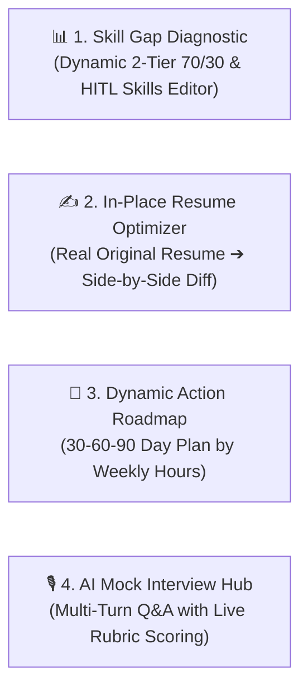

# 🚀 PathCraft AI - Enterprise Career & Skill Intelligence Copilot

[](https://www.python.org/)
[](https://cloud.google.com/vertex-ai)
[](https://deepmind.google/technologies/gemini/)
[](https://fastapi.tiangolo.com/)
[](https://streamlit.io/)
[](LICENSE)

> **PathCraft AI** is an enterprise-grade autonomous multi-agent career intelligence platform powered by **Google ADK 2.0 (Agent Development Kit)**, **Gemini 2.5**, **Dynamic Vector Semantic RAG**, and **Model Context Protocol (MCP)** tools. Featuring a Human-in-the-Loop (HITL) architecture, it dynamically diagnoses 2-tier weighted skill gaps against live 2026 hiring markets, optimizes authentic resumes in-place with side-by-side comparisons, customizes 30-60-90 day upskilling roadmaps by weekly study budget, and conducts interactive multi-turn AI mock interviews.

---

## 📑 Table of Contents

- [The 4 Core Intelligence Hubs](#-the-4-core-intelligence-hubs)
- [Key Upgrades & Architecture](#-key-upgrades--architecture)
- [The 10 Autonomous Agents](#-the-10-autonomous-agents)
- [Installation & Setup](#-installation--setup)
- [Running the Applications](#-running-the-applications)
- [Testing & Validation](#-testing--validation)

---

## 🖥️ The 4 Core Intelligence Hubs



1. **📊 Hub 1: Dynamic Skill Gap Diagnostic & HITL Profile Verification**
   - **100% Dynamic Market Grounding**: Queries live 2026 hiring requirements via Google Search Grounding for any target role and seniority level.
   - **2-Tier 70/30 Weighted Scoring**: Core Must-Haves (70% weight) vs. Advanced Differentiators (30% weight).
   - **Interactive Verified Skills Editor**: Review, add, remove, and confirm skills before running diagnostics.

2. **✍️ Hub 2: Authentic In-Place Resume Optimizer (Side-by-Side Comparison)**
   - **100% Authentic Preservation**: Keeps your real companies, dates, job titles, and degrees intact.
   - **Surgical Google XYZ Upgrades**: Rewrites weak bullet points into high-impact power bullets (`Accomplished [X] as measured by [Y], by doing [Z]`) and weaves in target keywords naturally.
   - **Side-by-Side Diff View**: Direct comparison of Original Resume vs. ATS-Optimized Resume with live in-browser editing and instant PDF/Markdown export.

3. **📅 Hub 3: Dynamic 30-60-90 Day Upskilling Roadmap & Learning Pack**
   - **Personalized Weekly Budget**: Adapts milestone action items to your time commitment (5 to 30 hrs/week) with interactive progress tracking.
   - **Curated Learning Pack**: Authoritative technical books (Google Books API), research preprints (arXiv API), official documentation, and real public GitHub reference repositories.

4. **🎙️ Hub 4: Interactive Multi-Turn AI Mock Interview Hub**
   - **Conversational Technical Q&A**: Progressively asks 3, 5, or 10 questions testing missing skill gaps (70%) and core architecture (30%).
   - **Turn-by-Turn Rubric Evaluation**: Instant 0–100 score, constructive strengths/gaps feedback, and production model answers.
   - **Final Performance Scorecard**: Overall average score, Hiring Readiness rating, and session summary.

---

## 🤖 The 10 Autonomous Agents

| # | Agent Name | Primary Responsibility |
|---|------------|------------------------|
| **1** | `ResumeParserADKAgent` | Ingests multi-page PDFs, work experience bullets, projects, certs, and LinkedIn. |
| **2** | `GitHubInspectorADKAgent` | Inspects GitHub repositories and languages via GitHub MCP. |
| **3** | `SkillNormalizerADKAgent` | Token-exact canonicalization and strict alias resolution. |
| **4** | `GapAnalyzerADKAgent` | Dynamic 2-tier 70/30 weighted gap analysis with Gemini Vector Embeddings. |
| **5** | `ATSAnalyzerADKAgent` | 100-point ATS audit and Google XYZ formula power bullet optimizer. |
| **6** | `ResumeGeneratorADKAgent` | Authentic In-Place Resume Optimizer on candidate's real text. |
| **7** | `RoadmapADKAgent` | 30-60-90 day upskilling roadmap customized to candidate's weekly time budget. |
| **8** | `RAGCuratorADKAgent` | Multi-format learning packs (Google Books API, arXiv API, Docs, Videos). |
| **9** | `ProjectGeneratorADKAgent` | Real public GitHub reference repositories and architecture blueprints. |
| **10** | `InterviewSimulatorADKAgent` | Multi-turn conversational mock interviewer with rubric scoring and report card. |

---

## ⚙️ Installation & Setup

```bash
# 1. Clone & create virtual environment
git clone https://github.com/your-org/pathcraft-ai.git
cd pathcraft-ai
python -m venv venv
source venv/bin/activate  # (or .\venv\Scripts\activate on Windows)

# 2. Install dependencies (including reportlab)
pip install -r requirements.txt

# 3. Set API Key
export GOOGLE_API_KEY="your_gemini_api_key_here"
```

---

## 🚀 Running the Applications

### 1. Streamlit 4-Hub Web Dashboard
```bash
streamlit run app.py
```
Open your browser at **`http://localhost:8501`** (or via Cloud Shell Web Preview).

### 2. FastAPI REST Server
```bash
python api_server.py
```
Interactive Swagger API documentation available at **`http://localhost:8000/docs`**.

---

## 🧪 Testing & Validation

```bash
python test_upgraded_pipeline.py
# 5 tests passed in 1.85s (Token precision, 2-tier gap analysis, in-place optimizer, multi-turn interview, full pipeline)
```
