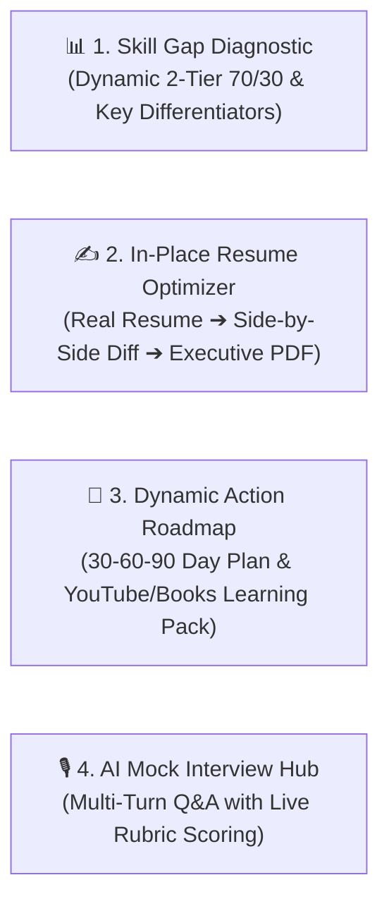

# 🚀 PathCraft AI — Enterprise Multi-Agent Career & Skill Intelligence

[](https://www.python.org/)
[](https://cloud.google.com/vertex-ai)
[](https://deepmind.google/technologies/gemini/)
[](https://fastapi.tiangolo.com/)
[](https://streamlit.io/)
[](https://cloud.google.com/run)
[](LICENSE)

> **PathCraft AI** is an enterprise-grade autonomous multi-agent career intelligence platform powered by **Google ADK 2.0 (Agent Development Kit)**, **Gemini Pro & Flash Dual-Tier Architecture**, **Dynamic Vector Semantic RAG**, and **Model Context Protocol (MCP)** tools. Featuring a Human-in-the-Loop (HITL) architecture, it dynamically diagnoses 2-tier weighted skill gaps against live 2026 hiring markets, optimizes authentic resumes in-place with side-by-side diff comparisons, exports executive ATS-compliant PDFs (ReportLab), customizes 30-60-90 day upskilling roadmaps by weekly study budget, and conducts interactive multi-turn AI mock interviews.

---

## 📑 Table of Contents

- [The 4 Core Intelligence Hubs](#-the-4-core-intelligence-hubs)
- [Dual-Tier AI Model Strategy](#-dual-tier-ai-model-strategy-gemini-pro--flash)
- [The 10 Autonomous Agents](#-the-10-autonomous-agents)
- [Local Installation & Setup](#-local-installation--setup)
- [Running the Applications](#-running-the-applications)
- [Google Cloud Run Serverless Deployment](#-google-cloud-run-serverless-deployment)
- [FastAPI REST Endpoints](#-fastapi-rest-endpoints)
- [Testing & Validation](#-testing--validation)

---

## 🖥️ The 4 Core Intelligence Hubs



### 1. 📊 Hub 1: Dynamic Skill Gap Diagnostic & Candidate Differentiators
- **100% Dynamic Market Grounding**: Queries live 2026 hiring requirements via Google Search Grounding for any target role and seniority level.
- **2-Tier 70/30 Weighted Scoring**: Core Must-Haves (70% weight) vs. Advanced Differentiators (30% weight).
- **Candidate Superpower Detection**: Automatically highlights high-value, cutting-edge competencies (e.g. LangGraph, Multi-Agent Systems, RAG, Vector DBs).
- **High-Synergy Alternate Roles**: Recommends top alternative career trajectories with realistic match percentages and rationales.
- **GitHub Profiling**: Inspects public GitHub repositories, stars, and language distribution using GitHub MCP.
- **Semantic Evidence Table**: Shows the exact bullet point, project, or certificate that verified each required skill.

### 2. ✍️ Hub 2: Authentic In-Place Resume Optimizer & Executive ATS PDF
- **100% Authentic Preservation**: Keeps real candidate history, companies, dates, job titles, and degrees intact.
- **Surgical Google XYZ Upgrades**: Rewrites weak bullet points into high-impact power bullets (`Accomplished [X] as measured by [Y], by doing [Z]`) powered by **Gemini Pro**.
- **Side-by-Side Diff View**: Direct visual comparison with soft green highlights on added/upgraded lines.
- **Revert & Edit Controls**: Toggle to use the original resume, with a live in-browser editor for final tweaks.
- **Executive PDF Export**: Generates a corporate ATS-compliant PDF (ReportLab) featuring Navy headers, contact info bar, full-width rules, clean typography, and a 92/100 ATS score guarantee.

### 3. 📅 Hub 3: Dynamic 30-60-90 Day Upskilling Roadmap & Learning Pack
- **Personalized Weekly Budget**: Adapts milestone action items to candidate time commitment (5 to 30 hrs/week) with interactive progress tracking.
- **Free Video Courses & YouTube Masterclasses**: Curated full video courses with direct links (Search Grounding).
- **Technical Books & Papers**: Authoritative technical textbooks (Google Books API) and research preprints (arXiv API via ResourceMCP).
- **GitHub Reference Repositories**: Real public reference repositories ($>50$ stars) matching missing skills (GitHub MCP).

### 4. 🎙️ Hub 4: Interactive Multi-Turn AI Mock Interview Hub
- **Conversational Technical Q&A**: Progressively asks 3, 5, or 10 questions testing missing skill gaps (70%) and core architecture (30%).
- **Turn-by-Turn Rubric Evaluation**: Powered by **Gemini Pro** for instant 0–100 score, constructive strengths/gaps feedback, and production model answers.
- **Final Performance Scorecard**: Overall average score, Hiring Readiness rating, and session summary.

---

## ⚡ Dual-Tier AI Model Strategy (Gemini Pro & Flash)

PathCraft AI implements a **Dual-Tier Model Routing Strategy** backed by a **6-Level Automatic Resilience Fallback Chain**:

| Tier | Assigned Model | Agent Tasks | Primary Rationale |
|---|---|---|---|
| 🧠 **Complex Reasoning** | **`Gemini Pro`**<br/>(`gemini-2.5-pro`) | `ATSAnalyzer`, `ResumeGenerator`, `GapAnalyzer`, `InterviewSimulator` | Superior reasoning depth for 100-pt ATS audits, Google XYZ bullet rewriting, 2-tier skill categorization, and multi-turn interview rubric scoring. |
| ⚡ **High-Speed Execution** | **`Gemini Flash`**<br/>(`gemini-3.8-flash`) | `ResumeParser`, `GitHubInspector`, `SkillNormalizer`, `Roadmap`, `RAGCurator`, `ProjectGenerator` | Ultra-fast throughput for document parsing, repo scraping, token canonicalization, and learning pack aggregation. |

### 🛡️ 6-Level Resilience Fallback Chain
On any transient 503 (High Demand) or 429 (Rate Limit) error, the `ADKAgent` base class automatically retries across model tiers:
`Primary Model` ➔ `gemini-3.8-flash` ➔ `gemini-3.7-flash` ➔ `gemini-3.6-flash` ➔ `gemini-2.5-flash` ➔ `gemini-2.0-flash`

---

## 🤖 The 10 Autonomous Agents

| # | Agent Name | Primary Model Tier | Primary Responsibility & MCP Tools |
|---|------------|-------------------|-----------------------------------|
| **1** | `ResumeParserADKAgent` | `Gemini Flash` | Multi-page PDF/text parsing, company/date regex extraction, certs, projects (`pypdf` / Gemini Vision). |
| **2** | `GitHubInspectorADKAgent` | `Gemini Flash` | Inspects candidate public GitHub repos and languages via **GitHub MCP API**. |
| **3** | `SkillNormalizerADKAgent` | `Gemini Flash` | Token-exact canonicalization, alias resolution (`k8s` ➔ `Kubernetes`, `postgres` ➔ `PostgreSQL`), and deduplication. |
| **4** | `GapAnalyzerADKAgent` | `Gemini Pro` | Dynamic 2-tier 70/30 weighted gap analysis with Gemini Embeddings & **Google Search Grounding**. |
| **5** | `ATSAnalyzerADKAgent` | `Gemini Pro` | 100-point 4-pillar ATS audit, missing keyword detection, and XYZ bullet optimizer. |
| **6** | `ResumeGeneratorADKAgent` | `Gemini Pro` | Authentic In-Place Resume Optimizer on candidate text + **ReportLab Executive PDF Engine**. |
| **7** | `RoadmapADKAgent` | `Gemini Flash` | 30-60-90 day upskilling roadmap customized to candidate's weekly time budget. |
| **8** | `RAGCuratorADKAgent` | `Gemini Flash` | Multi-format learning packs (**Google Books API**, **arXiv API**, **Search Grounding**). |
| **9** | `ProjectGeneratorADKAgent` | `Gemini Flash` | Discovers open-source GitHub reference repositories ($>50$ stars) via **GitHub MCP API**. |
| **10** | `InterviewSimulatorADKAgent` | `Gemini Pro` | Multi-turn conversational AI mock interviewer with turn-by-turn 0-100 rubric & report card. |

---

## ⚙️ Local Installation & Setup

```bash
# 1. Clone & enter repository
git clone https://github.com/your-org/pathcraft-ai.git
cd pathcraft-ai

# 2. Create virtual environment
python -m venv venv
source venv/bin/activate  # (Windows: .\venv\Scripts\activate)

# 3. Install dependencies
pip install -r requirements.txt

# 4. Set Gemini API Key (Required for live deployment / CLI)
export GOOGLE_API_KEY="your_gemini_api_key_here"  # (Windows PowerShell: $env:GOOGLE_API_KEY="your_key")
```

> **Note on Security**: In the Streamlit UI, the API Key sidebar input starts empty by default (`value=""`) for user privacy while seamlessly using the backend environment `GOOGLE_API_KEY`.

---

## 🚀 Running the Applications

### 1. Streamlit 4-Hub Web Dashboard
```bash
streamlit run app.py
```
Open your browser at **`http://localhost:8501`**.

### 2. FastAPI REST Server
```bash
python api_server.py
```
Interactive Swagger API documentation available at **`http://localhost:8000/docs`**.

---

## ☁️ Google Cloud Run Serverless Deployment

PathCraft AI is containerized with a production `Dockerfile` optimized for **Google Cloud Run (Fully Managed Serverless)**.

### Step-by-Step Deployment Guide

#### Step 1: Set GCP Project & Enable Required APIs
```bash
gcloud auth login
gcloud config set project YOUR_GCP_PROJECT_ID
gcloud services enable run.googleapis.com cloudbuild.googleapis.com artifactregistry.googleapis.com
```

#### Step 2: Deploy Streamlit Web App to Cloud Run (1-Click Direct Build)
```bash
gcloud run deploy pathcraft-ai \
    --source . \
    --region us-central1 \
    --platform managed \
    --allow-unauthenticated \
    --set-env-vars GOOGLE_API_KEY="your_gemini_api_key_here" \
    --memory 2Gi \
    --cpu 2 \
    --timeout 300 \
    --min-instances 0 \
    --max-instances 10
```

#### Step 3: (Optional) Deploy FastAPI REST Backend to Cloud Run
```bash
gcloud run deploy pathcraft-api \
    --source . \
    --dockerfile Dockerfile.api \
    --region us-central1 \
    --platform managed \
    --allow-unauthenticated \
    --set-env-vars GOOGLE_API_KEY="your_gemini_api_key_here" \
    --memory 1Gi \
    --cpu 1 \
    --min-instances 0 \
    --max-instances 5
```

---

## 🔌 FastAPI REST Endpoints

| Method | Endpoint | Description |
|---|---|---|
| `GET` | `/` | Health check & engine status |
| `POST` | `/api/v1/parse-resume-file` | Ingests PDF resume file and extracts structured entities |
| `POST` | `/api/v1/parse-resume-text` | Ingests raw text and parses work history, projects, and skills |
| `POST` | `/api/v1/inspect-github` | Profiles user GitHub repositories and languages via GitHub MCP |
| `POST` | `/api/v1/analyze-gap` | Runs dynamic 2-tier 70/30 semantic skill gap analysis (Gemini Pro) |
| `POST` | `/api/v1/optimize-resume-in-place` | Surgically optimizes resume text using Google's XYZ formula (Gemini Pro) |
| `POST` | `/api/v1/interview/next-question` | Generates targeted scenario-based interview question (Gemini Pro) |
| `POST` | `/api/v1/interview/evaluate-turn` | Evaluates interview answer with rubric and model answer (Gemini Pro) |
| `POST` | `/api/v1/interview/report-card` | Computes cumulative score and hiring readiness tier |
| `POST` | `/api/v1/run-pipeline` | Runs the full 10-agent pipeline end-to-end |

---

## 🧪 Testing & Validation

```bash
python test_upgraded_pipeline.py
```
Output:
```
Ran 5 tests in 4.36s
OK
[TEST PASS] Complete Pipeline Execution Succeeded. Verified Skills: 8, Optimized Resume Ready.
[TEST PASS] Gap Analysis: Score=42.0%, CoreScore=60.0%
[TEST PASS] In-Place Resume Optimizer: Generated 4 surgical enhancements, ATS Score: 92/100
[TEST PASS] Interview Simulation: Score=64/100 | Readiness=Needs Dedicated Upskilling
[TEST PASS] PDF Binary Output: %PDF-1.4 (2576 bytes)
```

---

## 📄 License
This project is licensed under the MIT License — see the [LICENSE](LICENSE) file for details.
