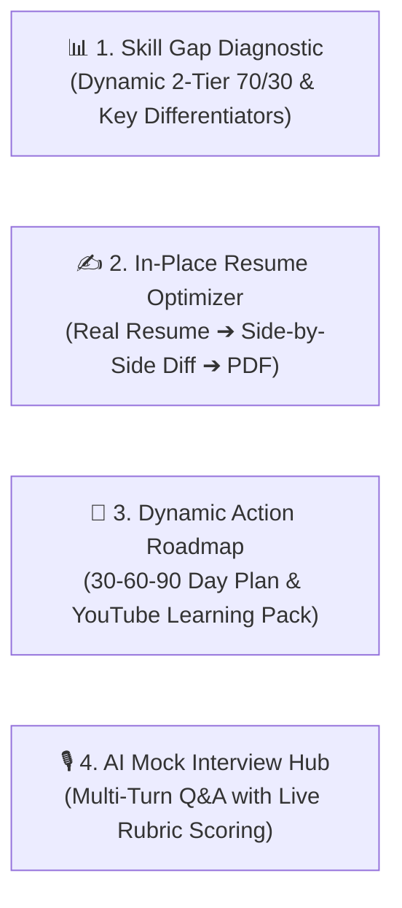

# 🚀 PathCraft AI — Enterprise Multi-Agent Career & Skill Intelligence

[](https://www.python.org/)
[](https://cloud.google.com/vertex-ai)
[](https://deepmind.google/technologies/gemini/)
[](https://fastapi.tiangolo.com/)
[](https://streamlit.io/)
[](https://cloud.google.com/run)
[](LICENSE)

> **PathCraft AI** is an enterprise-grade autonomous multi-agent career intelligence platform powered by **Google ADK 2.0 (Agent Development Kit)**, **Gemini 2.5**, **Dynamic Vector Semantic RAG**, and **Model Context Protocol (MCP)** tools. Featuring a Human-in-the-Loop (HITL) architecture, it dynamically diagnoses 2-tier weighted skill gaps against live 2026 hiring markets, optimizes authentic resumes in-place with side-by-side diff comparisons, customizes 30-60-90 day upskilling roadmaps by weekly study budget, and conducts interactive multi-turn AI mock interviews.

---

## 📑 Table of Contents

- [The 4 Core Intelligence Hubs](#-the-4-core-intelligence-hubs)
- [System Architecture](#-system-architecture)
- [The 10 Autonomous Agents](#-the-10-autonomous-agents)
- [Local Installation & Setup](#-local-installation--setup)
- [Running the Applications](#-running-the-applications)
- [Google Cloud Run Serverless Deployment](#-google-cloud-run-serverless-deployment)
- [FastAPI REST Endpoints](#-fastapi-rest-endpoints)
- [Testing & Validation](#-testing--validation)

---

## 🖥️ The 4 Core Intelligence Hubs



### 1. 📊 Hub 1: Dynamic Skill Gap Diagnostic & Candidate Differentiators
- **100% Dynamic Market Grounding**: Queries live 2026 hiring requirements via Google Search Grounding for any target role and seniority level.
- **2-Tier 70/30 Weighted Scoring**: Core Must-Haves (70% weight) vs. Advanced Differentiators (30% weight).
- **Key Differentiators**: Automatically highlights advanced competencies detected across work history, projects, and certifications.
- **High-Synergy Alternate Roles**: Suggests top alternative career paths with realistic match percentages and grounded rationales.
- **GitHub Profiling**: Automatically inspects public GitHub repositories, stars, and language distribution.
- **Semantic Evidence Table**: Shows the exact bullet point, project, or certificate that verified each required skill.

### 2. ✍️ Hub 2: Authentic In-Place Resume Optimizer (Side-by-Side Comparison)
- **100% Authentic Preservation**: Keeps your real companies, dates, job titles, and degrees intact.
- **Surgical Google XYZ Upgrades**: Rewrites weak bullet points into high-impact power bullets (`Accomplished [X] as measured by [Y], by doing [Z]`) and weaves in target keywords naturally.
- **Side-by-Side Diff View**: Direct visual comparison with soft green highlights on added/upgraded lines.
- **Revert & Edit Controls**: Toggle to use the original resume, with a live in-browser editor for final tweaks.
- **Executive PDF Export**: Generates an executive-styled PDF with navy section headers, contact bars, and ATS-compliant typography.

### 3. 📅 Hub 3: Dynamic 30-60-90 Day Upskilling Roadmap & Learning Pack
- **Personalized Weekly Budget**: Adapts milestone action items to your time commitment (5 to 30 hrs/week) with interactive progress tracking.
- **Free Video Courses & YouTube Masterclasses**: Curated full video courses with direct links.
- **Technical Books & Papers**: Authoritative technical textbooks (Google Books API) and research preprints (arXiv API).
- **GitHub Reference Repositories**: Real public reference repositories ($>50$ stars) matching missing skills.

### 4. 🎙️ Hub 4: Interactive Multi-Turn AI Mock Interview Hub
- **Conversational Technical Q&A**: Progressively asks 3, 5, or 10 questions testing missing skill gaps (70%) and core architecture (30%).
- **Turn-by-Turn Rubric Evaluation**: Instant 0–100 score, constructive strengths/gaps feedback, and production model answers.
- **Final Performance Scorecard**: Overall average score, Hiring Readiness rating, and session summary.

---

## 🤖 The 10 Autonomous Agents

| # | Agent Name | Primary Responsibility |
|---|------------|------------------------|
| **1** | `ResumeParserADKAgent` | Multi-page PDF/text parsing, company/date regex extraction, projects, certs, and LinkedIn. |
| **2** | `GitHubInspectorADKAgent` | Inspects public GitHub repositories and programming languages via GitHub MCP. |
| **3** | `SkillNormalizerADKAgent` | Token-exact canonicalization and strict alias resolution. |
| **4** | `GapAnalyzerADKAgent` | Dynamic 2-tier 70/30 weighted gap analysis with Gemini Vector Embeddings & live search. |
| **5** | `ATSAnalyzerADKAgent` | 100-point 4-pillar ATS audit and Google XYZ formula power bullet optimizer. |
| **6** | `ResumeGeneratorADKAgent` | Authentic In-Place Resume Optimizer on candidate's real text + Executive PDF generator. |
| **7** | `RoadmapADKAgent` | 30-60-90 day upskilling roadmap customized to candidate's weekly time budget. |
| **8** | `RAGCuratorADKAgent` | Multi-format learning packs (YouTube Courses, Google Books API, arXiv API, Docs). |
| **9** | `ProjectGeneratorADKAgent` | Real public GitHub reference repositories and architecture blueprints. |
| **10** | `InterviewSimulatorADKAgent` | Multi-turn conversational mock interviewer with rubric scoring and report card. |

---

## ⚙️ Local Installation & Setup

```bash
# 1. Clone & enter repository
git clone https://github.com/your-org/pathcraft-ai.git
cd pathcraft-ai

# 2. Create virtual environment
python -m venv venv
source venv/bin/activate  # (Windows: .\venv\Scripts\activate)

# 3. Install dependencies
pip install -r requirements.txt

# 4. Set Gemini API Key
export GOOGLE_API_KEY="your_gemini_api_key_here"  # (Windows PowerShell: $env:GOOGLE_API_KEY="your_key")
```

---

## 🚀 Running the Applications

### 1. Streamlit 4-Hub Web Dashboard
```bash
streamlit run app.py
```
Open your browser at **`http://localhost:8501`**.

### 2. FastAPI REST Server
```bash
python api_server.py
```
Interactive Swagger API documentation available at **`http://localhost:8000/docs`**.

---

## ☁️ Google Cloud Run Serverless Deployment

PathCraft AI is fully containerized with a production `Dockerfile` optimized for **Google Cloud Run (Fully Managed Serverless)**.

### Step-by-Step Deployment Guide

#### Prerequisites
- A Google Cloud Platform (GCP) Project with billing enabled.
- [Google Cloud SDK (`gcloud`)](https://cloud.google.com/sdk/docs/install) installed and configured.

#### Step 1: Set GCP Project & Enable Required APIs
```bash
# Authenticate gcloud
gcloud auth login

# Set your active project
gcloud config set project YOUR_GCP_PROJECT_ID

# Enable Cloud Run, Cloud Build, and Artifact Registry APIs
gcloud services enable run.googleapis.com cloudbuild.googleapis.com artifactregistry.googleapis.com
```

#### Step 2: Deploy Streamlit Web App to Cloud Run (1-Click Direct Build)
```bash
gcloud run deploy pathcraft-ai \
    --source . \
    --region us-central1 \
    --platform managed \
    --allow-unauthenticated \
    --set-env-vars GOOGLE_API_KEY="your_gemini_api_key_here" \
    --memory 2Gi \
    --cpu 2 \
    --timeout 300 \
    --min-instances 0 \
    --max-instances 10
```

#### Step 3: (Optional) Deploy FastAPI REST Backend to Cloud Run
```bash
gcloud run deploy pathcraft-api \
    --source . \
    --dockerfile Dockerfile.api \
    --region us-central1 \
    --platform managed \
    --allow-unauthenticated \
    --set-env-vars GOOGLE_API_KEY="your_gemini_api_key_here" \
    --memory 1Gi \
    --cpu 1 \
    --min-instances 0 \
    --max-instances 5
```

#### Step 4: Access Your Live Application
Once deployment completes, `gcloud` outputs your live HTTPS URL:
```
Service URL: https://pathcraft-ai-xyz123-uc.a.run.app
```
Open this URL in any browser to use PathCraft AI serverlessly with auto-scaling to zero when idle.

---

## 🔌 FastAPI REST Endpoints

| Method | Endpoint | Description |
|---|---|---|
| `GET` | `/` | Health check & engine status |
| `POST` | `/api/v1/parse-resume-file` | Ingests PDF resume file and extracts structured entities |
| `POST` | `/api/v1/parse-resume-text` | Ingests raw text and parses work history, projects, and skills |
| `POST` | `/api/v1/inspect-github` | Profiles user GitHub repositories and languages |
| `POST` | `/api/v1/analyze-gap` | Runs dynamic 2-tier 70/30 semantic skill gap analysis |
| `POST` | `/api/v1/optimize-resume-in-place` | Surgically optimizes resume text using Google's XYZ formula |
| `POST` | `/api/v1/interview/next-question` | Generates targeted scenario-based interview question |
| `POST` | `/api/v1/interview/evaluate-turn` | Evaluates interview answer with rubric and model answer |
| `POST` | `/api/v1/interview/report-card` | Computes cumulative score and hiring readiness tier |
| `POST` | `/api/v1/run-pipeline` | Runs the full 10-agent pipeline end-to-end |

---

## 🧪 Testing & Validation

```bash
python test_upgraded_pipeline.py
```
Output:
```
Ran 5 tests in 3.18s
OK
[TEST PASS] Complete Pipeline Execution Succeeded. Verified Skills: 8, Optimized Resume Ready.
[TEST PASS] Gap Analysis: Score=42.0%, CoreScore=60.0%
[TEST PASS] In-Place Resume Optimizer: Generated 4 surgical enhancements, ATS Score: 92/100
[TEST PASS] Interview Simulation: Score=64/100 | Readiness=Needs Dedicated Upskilling
```

---

## 📄 License
This project is licensed under the MIT License — see the [LICENSE](LICENSE) file for details.
